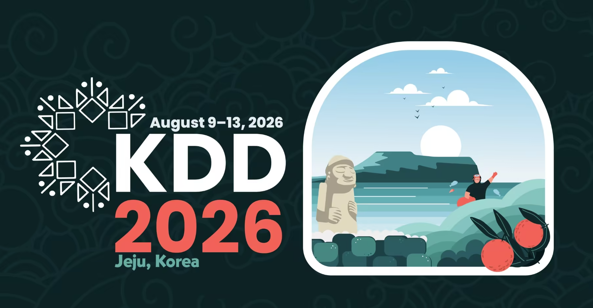

<p align="center">
  
</p>
<div class="alert alert-primary" role="alert" style="text-align: center; margin-top: 30px; margin-bottom: 30px; border-radius: 10px;">
  <h5 style="margin-bottom: 10px;">📢 Call for Papers is OPEN!</h5>
  <p style="margin-bottom: 15px; font-size: 1.1em;">
    <strong>Paper Submission Deadline:</strong> May 23rd, 2026 (AoE) <br>
    <strong>Notification:</strong> June 8th, 2026
  </p>
  <a href="#这里先空着" class="btn btn-primary" style="border-radius: 20px; padding: 8px 20px;">Submit via OpenReview (Link Coming Soon)</a>
</div>


### Overview

As LLMs such as GPT-4 continue to redefine boundaries in both complexity and capability, their integration into agent-based systems within the scientific and societal domains is not just beneficial but essential. In particular, Agentic AI systems and Large Language Models (LLMs) have demonstrated substantial value in orchestrating complex pipelines, reasoning over large datasets, and generating insights across various fields such as healthcare, environmental science, education, public policy, and social sciences. By bringing together experts and enthusiasts from diverse fields, the workshop aims to foster a comprehensive understanding of how LLMs and agent-based architectures jointly redefine traditional research methodologies. Participants will explore novel agentic frameworks, multi-agent collaboration, and real-world deployments to harness the power of LLM-powered agents for greater efficiency and innovation in their respective fields, potentially catalyzing a new era of scientific and societal advancement. Therefore, we propose the Second SciSoc Agents & LLMs Workshop at KDD'26: "Agentic AI for Scientific and Societal Advances" aims to explore the profound implications and potential of Agentic AI and LLMs in driving forward scientific inquiry and addressing critical societal challenges.

### OBJECTIVES

Autonomous agents and LLMs for scientific and societal advances (SciSoc Agents & LLM) represent an evolving concept that shifts the focus from simple question-answer tasks to broader and more impactful applications in science and society. Autonomous agents and LLMs have demonstrated capabilities such as solving university-level math problems by generating solution code, supporting language translation, and answering questions on bar exams with high accuracy, all without additional training[cite: 63]. Given the expanded scope and increasing power of agents and LLMs, their potential to significantly impact scientific discovery and societal progress is becoming increasingly evident. Agentic AI and LLMs have opened up vast opportunities for scaling and accelerating advancements across scientific and social domains. For example, MetaAI introduced the first science-specific LLM designed to support scientific discovery in research, while LLMs have also enabled large-scale computational social science research. These advancements have found LLMs’ potential for scientific and societal advances. 

The objective of this workshop is to explore recent advances in both the theoretical foundations and practical applications on science and society of agentic AI and LLMs. We propose the SciSoc Agents & LLMs Workshop at KDD’26 to serve as a platform where academic researchers and industry professionals can present and discuss cutting-edge research, real-world implementations, and new applications of SciSoc Agents & LLMs. This timing aligns perfectly with the current momentum in Agentic AI and LLM research and application, making it an essential event for stakeholders aiming to shape the future of scientific and societal advancements. Moreover, the interdisciplinary nature of KDD encourages a broad spectrum of ideas and solutions, which creates an optimal environment for investigating the extensive applications of LLMs. This workshop will also serve as a nice complement to the potential LLM Day at KDD’26, providing a specialized focus on scientific and societal advances and fostering interactions among participants.

### TOPICS 

We particularly encourage contributions that demonstrate the practical applications of Large Language Models (LLMs) and autonomous agents in addressing real-world challenges. Relevant topics, focused on scientific and societal applications, **include but are not limited to** the following list:

- Pre-training and fine-tuning of foundation models for agent-based scientific applications 
- Multimodal agentic systems integrating text, images, graphs, time series, and structured data 
- Retrieval-augmented and tool-augmented agents for scientific and societal tasks
- Integration of LLMs with tools, memory, planning, and environment interaction
- Active learning strategies with LLMs in practical applications
- Enhancing code generation for scientific practitioners
- Responsible, trustworthy, and ethical considerations of agent-based AI in society
- Benchmarks, datasets, and evaluation protocols for agentic AI and LLM-based agents 
- Agentic workflows for AI-driven experimentation, hypothesis generation, and validation
- Self-evolving agents with autonomous learning, adaptation, and continual improvement 

We enthusiastically invite submissions from diverse fields at the nexus of AI, science, and society, including but not limited to healthcare, environmental science, education, public policy, social science, chemistry, and biology.


### Submission Details

We welcome two types of submissions: 
* Full research papers – up to 8 pages of main content, with unlimited additional pages for references and an optional appendix. 
* Short research papers, technical papers, and vision papers – up to 4 pages of main content, plus one additional page for references and an optional appendix.

All submissions must be in PDF format, written in English, formatted in double columns, and adhere to the [ACM template and guidelines](https://www.acm.org/publications/proceedings-template) (also available in [Overleaf](https://www.overleaf.com/latex/templates/association-for-computing-machinery-acm-sig-proceedings-template/bmvfhcdnxfty)). Following the KDD’26 conference submission policy, reviews are double-blind to avoid biases, and author names and affiliations should NOT be listed. The recommended setting for LaTeX is:
```latex
\documentclass[sigconf,anonymous,review]{acmart}

```

Submitted works will be assessed based on their technical merit, novelty, clarity, relevance to the workshop, and potential impact, with attention to methodological rigor and reproducibility. We encourage authors to make data and code available publicly when possible.

Accepted papers will be made available on the workshop website but will not be part of the KDD’26 proceedings, as they are **non-archival**. This allows authors to submit works that are concurrently under review elsewhere or published.

Final selections for a Best Paper, as well as recognitions for Best Presentation or Best Poster, will be announced at the end of the workshop.

All submissions must be uploaded electronically to OpenReview  at: [Link to be updated for 2026].

At least one of the authors of the accepted workshop papers must register for the workshop and be present on the day of the workshop.

For questions regarding submissions, please contact the primary organizer at: jiayuan@hippocraticai.com.


### Important Dates

The important dates of the workshop should not be later than:

* Workshop Paper Submission Dates:
  - Workshop Paper Submission: ~~May 8th~~ ~~May 19th~~ May 23rd, 2026
  - Workshop Paper Notification: June 8th, 2026


* Practical Workshop Organization Dates:
  - Workshop Website and CFP: April 15th, 2026
  - Notifications to Workshop Chairs (number of papers, acceptance rate, etc.): June 15th, 2026
  - Final Submission of Workshop Program and Materials and Full Workshop Websites Online: June 24th, 2026
  - Workshop Date: 13:00-17:00, August 4th, 2026

All submission deadlines are end-of-day in the **[Anywhere on Earth (AoE)](https://time.is/Anywhere_on_Earth)** time zone.
